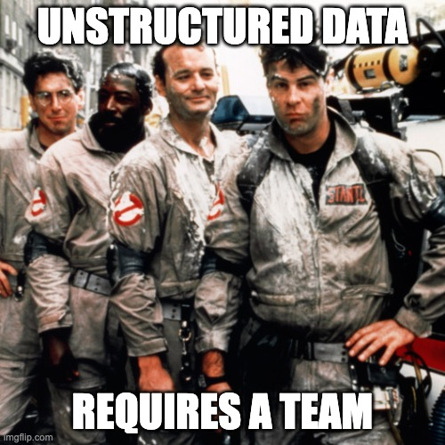

# 👻 SnowGhost Breakers - Snowflake Ghost Detection System

A comprehensive Snowflake-native application for detecting, tracking, and analyzing paranormal activity using Snowflake Cortex AI.


## 🎯 Overview

SnowGhost Breakers is a complete paranormal investigation system that demonstrates the power of Snowflake's data platform combined with Cortex AI capabilities. The application handles ghost sightings, evidence analysis, investigation management, and AI-powered insights.

https://www.snowghostbreakers.com/


## ✨ Features

- **📊 Comprehensive Data Model**: Tables for ghosts, sightings, evidence, investigations, and sensor readings
- **🤖 Cortex AI Integration**: 
  - Sentiment analysis of sighting reports
  - Automated threat assessments
  - Ghost classification using LLMs
  - **AI-powered image embeddings (1024-dimensional vectors)**
  - **Vector similarity search with custom cosine similarity**
  - **💬 SnowBreakers Chat: Conversational AI interface for natural language querying**
  - AI-generated investigation reports
  - Image and audio analysis with Cortex Vision AI
- **🕸️ Neo4j Graph Analytics**: Network analysis of ghost relationships, community detection, centrality scoring, and predictive modeling
- **📈 Analytics & Dashboards**: Pre-built semantic views and analytics
- **🎨 Streamlit Application**: Interactive web interface with image upload, AI analysis, location picker, and vocabulary browser
- **📓 Jupyter Notebooks**: Multimodal analytics and standard data loading pipelines
- **🔍 Cortex Analyst**: Natural language queries for ghost data
- **⚡ Stored Procedures**: Automated processing workflows
- **🗺️ Geospatial Analysis**: Hotspot detection, mapping, and interactive sighting visualization
- **🤖 Agentic AI System**: Autonomous agents for threat detection, pattern analysis, and response coordination
- **🔌 MCP Server**: Model Context Protocol integration for external AI agents
- **📚 Business Vocabulary**: Ghost ontology and taxonomy with searchable Streamlit interface

## 🏗️ Architecture

```
SnowGhostBreakers/
├── sql/
│   ├── 01_setup_database.sql          # Database and schema setup
│   ├── 02_create_tables.sql           # Core table definitions
│   ├── 03_sample_data.sql             # Sample ghost data
│   ├── 04_stored_procedures.sql       # Business logic procedures
│   ├── 05_semantic_views.sql          # Analytics views
│   ├── 06_cortex_ai_functions.sql     # AI integration examples
│   ├── 14_image_embeddings_table.sql  # **NEW: Image similarity search**
│   └── ...                            # Additional setup scripts
├── streamlit_app/
│   └── ghost_detection_app.py         # Main Streamlit application
│       └── **NEW: 🔍 Image Similarity page**
├── notebooks/
│   ├── 01_ghost_analytics.ipynb       # Analytics notebook
│   └── 02_data_loader.ipynb           # Bulk data loading
├── scripts/
│   ├── bulk_ghost_processor.py        # Bulk data processor (key pair auth)
│   └── ghost_analytics.py             # Advanced analytics (key pair auth)
├── cortex_analyst/
│   └── ghost_semantic_model.yaml      # Cortex Analyst configuration
├── setup.sql                          # Master setup script
└── README.md                          # This file
```

## 🚀 Quick Start




### Prerequisites

- Snowflake account with Cortex AI enabled
- Appropriate warehouse and compute resources
- Permissions to create databases, tables, and procedures

### Installation

1. **Clone or download this repository**

2. **Run the setup script** in your Snowflake worksheet:
   ```sql
   -- Option 1: Run individual scripts in order
   !source sql/01_setup_database.sql
   !source sql/02_create_tables.sql
   !source sql/03_sample_data.sql
   !source sql/04_stored_procedures.sql
   !source sql/05_semantic_views.sql
   !source sql/06_cortex_ai_functions.sql
   
   -- Option 2: Use master setup script
   !source setup.sql
   ```

3. **Verify installation**:
   ```sql
   USE DATABASE GHOST_DETECTION;
   SHOW TABLES IN SCHEMA APP;
   SHOW VIEWS IN SCHEMA ANALYTICS;
   ```

### Running the Streamlit App

1. Navigate to Snowflake Streamlit:
   - Go to your Snowflake account
   - Navigate to "Streamlit" in the left sidebar
   - Create a new Streamlit app
   - Copy the contents of `streamlit_app/ghost_detection_app.py`
   - Run the app

2. Or use Streamlit in Snowflake (SiS):
   ```sql
   CREATE STREAMLIT GHOST_DETECTION.APP.GHOST_DETECTION_APP
   FROM 'streamlit_app'
   MAIN_FILE = 'ghost_detection_app.py';
   ```

## 📊 Data Model

### Core Tables

#### GHOSTS
Master registry of all detected paranormal entities
- ghost_id, ghost_name, ghost_type, threat_level
- manifestation_frequency, confidence_score
- status tracking (Active, Dormant, Captured, Neutralized)

#### GHOST_SIGHTINGS
Individual encounter events
- Location (with geospatial coordinates)
- Environmental conditions (temperature, EMF readings)
- Witness information
- Paranormal activity level (1-10 scale)

#### GHOST_EVIDENCE
Multimedia evidence storage
- Images, videos, audio recordings
- Metadata and file paths
- Processing status

#### GHOST_AI_ANALYSIS
AI-powered analysis results
- Cortex model outputs
- Confidence scores
- Entity detection
- Recommendations

#### INVESTIGATIONS
Case management
- Investigation teams
- Status tracking
- Evidence collection
- Outcomes

## 🤖 Cortex AI Capabilities

### 1. Text Analysis
- **Sentiment Analysis**: Assess the emotional tone of sighting reports
- **Classification**: Automatically categorize ghost types and threat levels
- **Summarization**: Generate concise reports from multiple sightings
- **Entity Extraction**: Identify key information from descriptions

### 2. Embeddings & Search
- **Vector Embeddings**: Convert descriptions to semantic vectors
- **Similarity Search**: Find related sightings and patterns
- **Cortex Search**: Natural language search over sighting data
- **🆕 Image Embeddings**: AI-powered image similarity search
  - 1024-dimensional vectors using `snowflake-arctic-embed-l-v2.0-8k`
  - Custom JavaScript cosine similarity function
  - Text-to-image and image-to-image search
  - Batch embedding generation
  - Real-time similarity scoring

### 3. Complete (LLM)
- **Report Generation**: Create comprehensive investigation reports
- **Threat Assessment**: AI-powered risk evaluation
- **Recommendations**: Tactical suggestions for investigations
- **Q&A**: Answer questions about ghost data

### Example Cortex Queries

```sql
-- Get AI threat assessment for a ghost
CALL GENERATE_GHOST_REPORT('GH001');

-- Classify ghost type from description
CALL CLASSIFY_GHOST_TYPE('Shadow figure moving through walls');

-- Analyze sighting with sentiment
SELECT 
    description,
    SNOWFLAKE.CORTEX.SENTIMENT(description) as fear_level
FROM GHOST_SIGHTINGS;

-- Find similar sightings
SELECT * FROM VW_SIMILAR_SIGHTINGS 
WHERE base_sighting_id = 'SIGHT001';

-- 🆕 Image similarity search
CALL FIND_SIMILAR_IMAGES('ghost orb', 10);
CALL FIND_SIMILAR_TO_IMAGE('EMB_ABC123', 5);
CALL BATCH_GENERATE_EMBEDDINGS(100);
```

## 📈 Analytics & Insights

### Pre-built Views

1. **VW_GHOST_ACTIVITY_SUMMARY**: Comprehensive ghost activity metrics
2. **VW_PARANORMAL_HOTSPOTS**: Geographic concentration analysis
3. **VW_INVESTIGATION_METRICS**: Case performance indicators
4. **VW_THREAT_MATRIX**: Threat level distribution
5. **VW_ACTIVITY_TIMELINE**: Temporal pattern analysis
6. **VW_AI_MODEL_METRICS**: AI performance tracking

### Key Metrics

- Total ghost count by type and threat level
- Sighting frequency and patterns
- Geographic hotspot identification
- Investigation success rates
- AI model confidence scores
- Environmental correlations

## 🎨 Streamlit Application Features

### Dashboard Pages

1. **📊 Dashboard**: Overview with key metrics and charts
2. **👻 Ghost Registry**: Detailed ghost profiles with AI reports
3. **📍 Sightings**: Location-based sighting browser
4. **🔬 Evidence Analysis**: Evidence processing status and AI results
5. **📋 Investigations**: Case management interface
6. **🤖 AI Insights**: Interactive AI query interface
7. **➕ New Sighting**: Report submission form with AI classification
8. **📈 Analytics**: Advanced analytics and visualizations

### Interactive Features

- Real-time data filtering
- Geographic mapping
- AI-powered report generation
- Threat level visualizations
- Timeline analysis

## 🔍 Cortex Analyst Integration

The semantic model (`cortex_analyst/ghost_semantic_model.yaml`) enables natural language queries:

**Example Questions:**
- "What are the most active ghosts in the past month?"
- "Which locations have the highest paranormal activity?"
- "Show me all extreme threat level ghosts"
- "What is the average EMF reading across all sightings?"

## 📓 Jupyter Notebooks

### 01_ghost_analytics.ipynb
Comprehensive analysis notebook including:
- Data overview and statistics
- Ghost type analysis
- Temporal patterns
- Geographic hotspots
- Environmental correlations
- AI model performance
- Predictive analytics

## 🔧 Customization

### Adding New Ghost Types
```sql
INSERT INTO GHOSTS (ghost_id, ghost_name, ghost_type, ...)
VALUES ('GH999', 'New Ghost', 'New_Type', ...);
```

### Creating Custom Analysis
```sql
-- Custom view example
CREATE VIEW MY_CUSTOM_ANALYSIS AS
SELECT 
    g.ghost_name,
    COUNT(s.sighting_id) as my_metric,
    SNOWFLAKE.CORTEX.COMPLETE('mistral-large2', 
        'Analyze this ghost: ' || g.description
    ) as ai_insight
FROM GHOSTS g
JOIN GHOST_SIGHTINGS s ON g.ghost_id = s.ghost_id
GROUP BY g.ghost_id, g.ghost_name, g.description;
```

### Extending the Streamlit App
Add new pages by modifying `ghost_detection_app.py` and following the existing page patterns.

## 🛡️ Security Considerations

- Implement row-level security for sensitive ghost data
- Use Snowflake's Dynamic Data Masking for PII (witness information)
- Configure proper role-based access control (RBAC)
- Audit trail through AUDIT_LOG table

## 📊 Sample Use Cases

### 1. Real-time Threat Monitoring
```sql
SELECT * FROM VW_REAL_TIME_THREAT_ASSESSMENT
WHERE threat_level = 'Extreme';
```

### 2. Hotspot Prediction
```sql
SELECT 
    location_name,
    AVG(paranormal_activity_level) as avg_activity,
    COUNT(*) as sightings_last_30days
FROM GHOST_SIGHTINGS
WHERE sighting_datetime >= DATEADD(day, -30, CURRENT_TIMESTAMP())
GROUP BY location_name
HAVING COUNT(*) >= 5
ORDER BY avg_activity DESC;
```

### 3. Investigation Resource Allocation
```sql
SELECT 
    priority,
    COUNT(*) as case_count,
    AVG(evidence_count) as avg_evidence
FROM INVESTIGATIONS
WHERE status IN ('Open', 'In_Progress')
GROUP BY priority;
```

## 🎓 Learning Resources

This application demonstrates:
- Snowflake table design and relationships
- Cortex AI functions (Complete, Sentiment, Embeddings)
- Stored procedure development
- Streamlit app development in Snowflake
- Semantic modeling for Cortex Analyst
- Advanced SQL analytics
- Geospatial data handling
- Time series analysis

## 🤝 Contributing

This is a demonstration application. To extend it:
1. Fork the repository
2. Add new features or analyses
3. Test with sample data
4. Submit pull requests

## 📄 License

Apache 2.0 License - See LICENSE file

## 🙏 Acknowledgments

- Inspired by the Ghostbusters franchise
- Built on Snowflake's powerful data platform
- Leverages Cortex AI capabilities
- Based on the original AIM-Ghosts project by tspannhw

## 📚 Documentation

**Comprehensive documentation is available in the `docs/` directory:**

- **Getting Started**: Installation guides, quick starts, and tutorials
- **Feature Guides**: Detailed documentation for each feature
- **Troubleshooting**: Fix guides and error resolution
- **Technical Reference**: API docs, architecture diagrams

See [`docs/README.md`](docs/README.md) for the complete documentation index.

**Quick Links:**
- [Quick Start Guide](docs/QUICKSTART.md)
- [Installation Guide](docs/INSTALLATION_GUIDE.md)
- [Image Embeddings Fixes](docs/IMAGE_EMBEDDINGS_ALL_FIXES.md)
- [SnowBreakers Chat Guide](docs/SNOWBREAKERS_CHAT_GUIDE.md)
- [Troubleshooting](docs/)

# Ghosts
Ghosts


### Logging, Trails and Notifications

````
CREATE OR REPLACE SECRET GHOST_DETECTION.APP.SLACK_WEBHOOK_SECRET
    TYPE = GENERIC_STRING
    SECRET_STRING = 'letters and numbers/it/stuff';
  
-- https://select.dev/posts/snowflake-slack-alerts


CREATE OR REPLACE NOTIFICATION INTEGRATION ghost_slack_alerts
TYPE = WEBHOOK
ENABLED = TRUE
WEBHOOK_URL='https://hooks.slack.com/services/SNOWFLAKE_WEBHOOK_SECRET'
WEBHOOK_SECRET = GHOST_DETECTION.APP.SLACK_WEBHOOK_SECRET
WEBHOOK_BODY_TEMPLATE='{"text": "SNOWFLAKE_WEBHOOK_MESSAGE"}'
WEBHOOK_HEADERS=('Content-Type'='application/json');

describe notification integration ghost_slack_alerts;

SELECT * FROM TABLE(INFORMATION_SCHEMA.NOTIFICATION_HISTORY());

CREATE OR REPLACE ALERT GHOST_TRAIL_DEMO_ALERT
WAREHOUSE = INGEST
SCHEDULE = '15 minute'
IF (EXISTS (
SELECT 1 FROM GHOST_DETECTION.APP.TRAIL_EVENTS
WHERE RECORD_TYPE = 'LOG'
AND RECORD['severity_text'] IN ('WARN','ERROR')
AND TIMESTAMP >= DATEADD(hour, -1, CURRENT_TIMESTAMP())
))
THEN CALL SYSTEM$SEND_SNOWFLAKE_NOTIFICATION(
  SNOWFLAKE.NOTIFICATION.TEXT_PLAIN(
    SNOWFLAKE.NOTIFICATION.SANITIZE_WEBHOOK_CONTENT('my message')
  ),
  SNOWFLAKE.NOTIFICATION.INTEGRATION('ghost_slack_alerts')
);


SELECT  * 
FROM GHOST_DETECTION.APP.TRAIL_EVENTS
WHERE RECORD_TYPE = 'LOG'
AND RECORD['severity_text'] IN ('WARN','ERROR')
AND TIMESTAMP >= DATEADD(hour, -1, CURRENT_TIMESTAMP());


CALL SYSTEM$SEND_SNOWFLAKE_NOTIFICATION(
  SNOWFLAKE.NOTIFICATION.TEXT_PLAIN(
    SNOWFLAKE.NOTIFICATION.SANITIZE_WEBHOOK_CONTENT('my message')),
  SNOWFLAKE.NOTIFICATION.INTEGRATION('ghost_slack_alerts')
);


SELECT
    DATE_TRUNC('day', START_TIME) AS usage_date,
    USERNAME,
    SUM(REQUEST_COUNT) AS total_messages,
    SUM(CREDITS) AS total_credits
FROM SNOWFLAKE.ACCOUNT_USAGE.CORTEX_ANALYST_USAGE_HISTORY
WHERE START_TIME >= DATEADD('day', -7, CURRENT_TIMESTAMP())
GROUP BY 1, 2
ORDER BY total_credits DESC, usage_date desc;


select *
FROM GHOST_DETECTION.APP.GHOST_SIGHTINGS;

alter table GHOST_DETECTION.APP.GHOST_SIGHTINGS
add column investigation_status varchar(25000);

````

### References

* https://medium.com/@tspann/ghosts-are-unstructured-data-i-e31b34c0d9e4
* https://github.com/tspannhw/AIM-Ghosts/
* https://github.com/tspannhw/FLaNK-python-processors/tree/main
* https://github.com/tspannhw/TrafficAI


## 📞 Support

For questions or issues:
- **First**, check the [`docs/`](docs/) directory for comprehensive guides
- Review Snowflake documentation for Cortex AI
- Examine the SQL comments for implementation details
- Check the sample data for usage patterns

## 🎃 Fun Facts

- The application uses real paranormal investigation terminology
- EMF (Electromagnetic Field) readings are actual ghost hunting metrics
- Temperature drops are commonly associated with paranormal activity
- The 1-10 paranormal activity scale is a simplified PKE meter reading

---

**Who you gonna call? SnowGhost Breakers!** 👻🚫

*Powered by Snowflake Cortex AI*
Tim Spann - Prompt Engineer, AI Hacker, Senior Solution Engineer, Paranormal Investigator

 🎉👻✨
